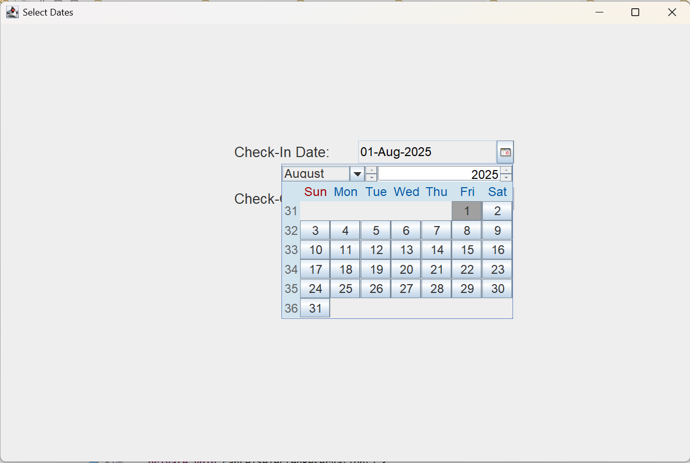

# Hotel Management System

A **Java-based Hotel Management System** built with **Swing GUI** and **MySQL database**. This project enables hotel staff to manage hotels, rooms, guests, and reservations efficiently.

---

## Features

-  Manage rooms (add, update, delete, view)
-  Guest management with full CRUD operations
-  Reservation system with check-in/check-out
-  MySQL database integration using JDBC
-  Interactive GUI using Java Swing
-  Reservation display with JTable

---

##  Technologies Used

- `Java (Core Java)`
- `Swing (GUI)`
- `JDBC`
- `MySQL`
- `Eclipse IDE`

---

## Project Structure

```
com.hms
├── db           JDBC connection class
├── dao          Interfaces for DAO pattern
├── dao.impl     DAO implementation using JDBC
├── entity       Entity classes (Hotel, Room, Guest, Reservation)
└── gui          GUI panels (HotelPanel, RoomPanel, GuestPanel, ReservationPanel)
```
##  GUI Screenshots & Flow

The Hotel Management System follows a smooth and user-friendly reservation flow. Here's a walkthrough with corresponding GUI screenshots:

---

###  Hotel Panel (Welcome Page)

The application begins with the **Hotel Panel**, where the hotel information is displayed and managed.


---

###  Date Selection Panel

After choosing a hotel, the user is prompted to **select check-in and check-out dates**.


---

### 🗓️ Calendar View

A calendar view is provided for users to easily pick dates.



---

###  Room Availability Panel

The system shows a list of **available rooms for the selected date range**.


---

###  Date Confirmation Dialogue Box

Before proceeding, the selected check-in/check-out dates are **confirmed** with the user.


---

###  Guest Details Panel

The user is then asked to **enter guest details** such as name, contact, and type (adult/child).


---

###  Reservation Panel

Finally, the **reservation is confirmed**, and details are saved in the database.


